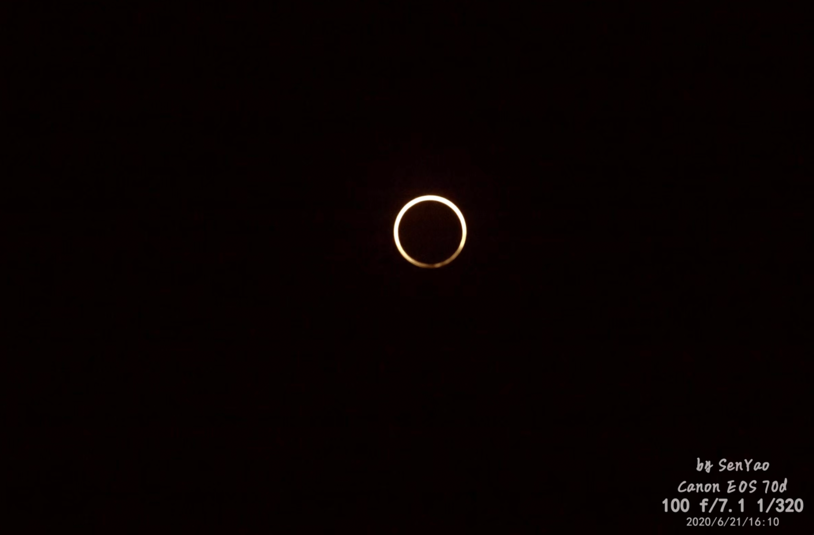
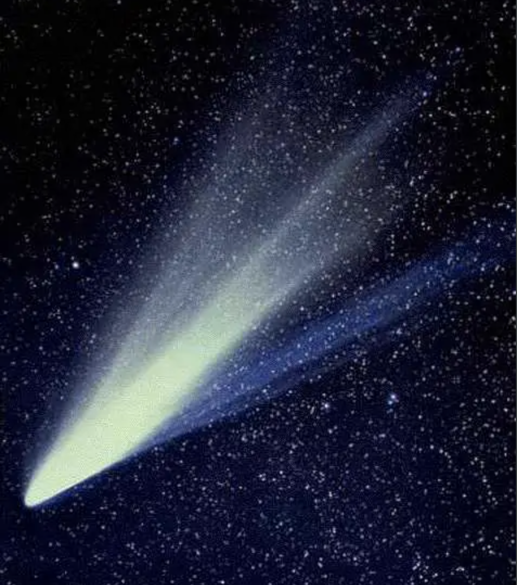
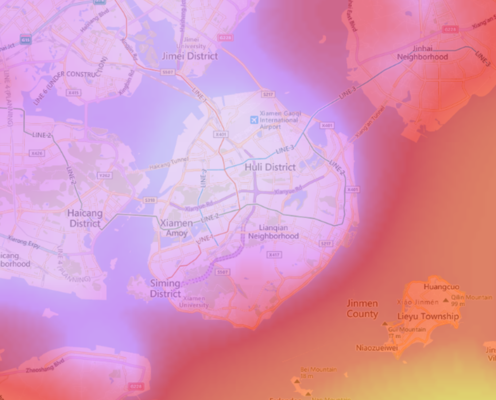
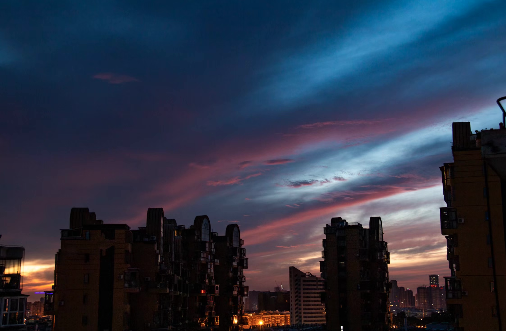
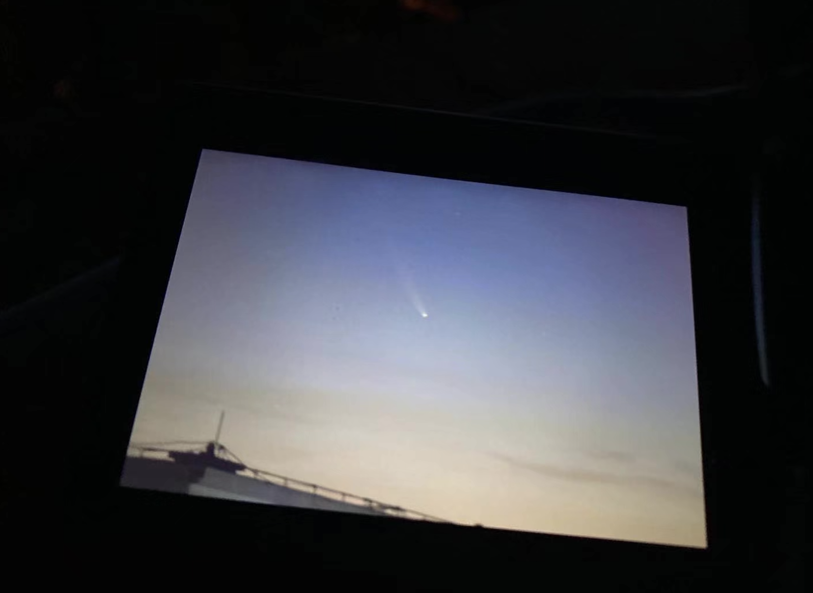

# C/2020/F3 NEOWISE 彗星拍摄实录

电信2102 林子垚 U202113904

---

## 天文缘起

在同龄人都在看故事书和小说的年纪，我却天天捧着科普书。那时候没有电脑和智能手机，一本十万个为什么就足以打发一个个求知欲爆棚的夜晚。我喜欢提问题，月亮上面有什么？蜻蜓为什么要点水？为什么会有花开花谢，潮起潮落？随着问题渐渐超出父母的回答能力，他们选择用一本本厚厚的科普书堵上我的嘴。

当时有一套百科全书深得我的喜爱，其中有一册专讲自然科学。而自然部分的开头就是天文。当第一群人类走出森林进入平原，仰起头看满天繁星时，天文学就开始了。我一直认为天文是自然科学之母。说得文邹邹一点，它致力于解释我们从何而来。

小孩子似乎对这些看不见摸不着的东西特别感兴趣，那时候的我几乎要把这一章节翻烂，比地球大几千倍的木星，几千万光年外的星云，最最酷炫的当然是黑洞——宇宙中的隐秘杀手，能悄无声息地吞噬一切。当时那本书还附了一套图，描绘了宇航员靠近黑洞后发生的一系列拉伸现象。

虽然那张图纯粹只是把宇航员的照片拉长变红，但它配上丰富的想象力，就足以给我留下深刻的童年阴影。如果要问为什么我喜欢天文却不敢在老师面前说我长大要当宇航员，那张图绝对难辞其咎。

## 带我入坑的日食

一直以来，天文对我来说始终是流于纸面的爱好，不曾有实操机会，直到2020年06月，厦门迎来了几百年难遇的日环食。我上高二，那时本来也只是抱着凑热闹的心态，单纯想拍张好看的照片，不枉厦门几百年难遇的一次日食。

本想到时候拿个手机随便拍拍，但毕竟日食这样的天文现象转瞬即逝，不容许失误，自然需要做好万全的准备。

我借到了一台破旧的单反相机和三脚架，查阅各种拍摄日食的资料。恶补本影半影的概念，初亏、食既、食甚、生光和复元的时刻。

罩上巴德膜后，常规的自动曝光拍出来漆黑一片，所以赶紧速成了一遍相机的曝光三要素

第一次拍摄天文现象，尤其是难度极大的日食，自然没法做到完美。但是就是这样一张稚嫩的照片，激发了我对天文的无限兴趣

我提前买了许多副日食眼镜分发给朋友，给他们科普了观察日食的基础知识，同时在社交媒体上分享我的照片。我切实感受到了天文，是能带来快乐，并且传播快乐的。

我如饥似渴地继续学习天文的知识，只希望不断精进拍出的照片的质量。

这样一个不同寻常的 2020 年似乎注定要让我走上天文之路。C/2020/F3 彗星，也就是后来被命名为 NEOWISE 的“新智”彗星来了。

在我的认知里，「彗星」这个词是百科全书里的一抹银色彗尾，从来不曾想象它在我眼前的样子。

星际的远客，太空的浪子。都说彗星是不祥之兆，可地上的人祸怎能推卸给天灾？

它成了我的下一个观测目标。

## 观测展望

我面临的第一个问题就是光污染。我从小生活在厦门岛内的正中央，7 级光污染将天空染成粉紫色，这样的天空足以抹杀每一个城市里长大的孩子的天文梦。

而那时的我也忙于高中学业，总不能指望父母上课时期带着我凌晨前往几十公里外的郊野。

其次就是肉眼不可见的问题。当时预报的星等超过四等。尽管对于彗星来说这是一个非常夸张的亮度，但是在 7 级光污染且手边没有双筒、指星笔的情况下，光是发现目标就是极大的挑战。唯一的解决方案就是尽可能精确地计算目标的方位角和高度角，利用相机长曝光来寻找它。

最后就是天气和时间。当时最佳观测时间大约在日出前的4:30-5:30左右，而当时厦门偏偏天公不作美，连着几天阴天，再加上期末考的压力，我对这次拍摄的热情愈发低落了。

“星星都没拍过几颗，还想着拍彗星呢。”我这样对自己说。

7月11日，Windy 显示 12 日凌晨将会有难得放晴的空窗期，而在 15 日以后，NEOWISE 的亮度将会骤降，因此 12 日凌晨是我唯一的观测机会了。

颇具戏剧性的是，12日恰好是化学竞赛考试。也就是说，我必须在凌晨拍完迅速收工，补觉到 7 点，再去学校参加考试。

显然，我介时只能在家附近活动，要是让父母知道我考试当天凌晨跑出去拍照，自然少不了家庭矛盾。

我最后敲定的观测点是家楼顶的电梯井上。遮挡少，容易到达。

## 踩点

根据 Stellarium 的相关数据，我提前确定了 NEOWISE 的高度角和方位角，前往天台踩点，确保不会被周围楼房遮挡

不幸的是，预期的方位角位置存在高楼，我必须在彗星落下，被楼房挡住之前拍下来。

但是好在有楼房作为参照物。考虑到手机指南针精度有限，我在 Google Earth 上标出了观测点和楼房，并且计算了相对角度，从而更加精确地确定方位角

.png)

## 拍摄

万事俱备，我提前一天晚上收拾好了摄影器材，打包放在门口。

凌晨4:00的闹钟响起，我翻身下床，背起十几斤的设备向天台进发。在这个时间点，背着厚重的背包在居民楼里穿梭，很难不被当成小偷。

实际上，我家那栋楼的天台东北角被电梯井遮挡，是无法获得东北角的视野的。为了获得尽可能高的观测点，我必须爬到三米高的没有任何防护装置的电梯井上方，冒着坠楼的风险架起设备。

但是抬头一看天，我心就凉了半截——乌云密布，最亮的几颗星星都难以辨认。

但我抱着“起都起了，再看一会”的心态，将单反对准计算好的方位角和高度角，以期能辨认出「NEOWISE」的剪影

由于星等太低，单反的实时预览并不能看到任何有价值的目标，因此我开启 5 s 的曝光，一遍又一遍地扫描那块天区。

经过三四十张无效的照片，我开始慌了。完全没有找到传说中的彗星。被云挡住了？被楼挡住了？还是我根本就算错了方位角？

但我选择相信我的判断和运气。

幸运女神又一次眷顾了这位新手天文爱好者。屏幕上出现了一道淡淡的微痕，我反复确认这不是相机镜头的污渍，而确确实实是我魂牵梦绕的那颗 NEOWISE。我调整曝光参数、对焦和构图，按下快门。

在太阳即将升起之际，拨云，见星。

古册里彗星们出没无常的行踪，在此刻被我记录下来。

## 后期

日出后，我匆忙在父母醒来之前回到家，匆匆睡去，准备上午的考试。毫无疑问，那天的化学竞赛我考的稀烂，脑子里只有这颗暗淡的光痕。

回到家我马上开启电脑，开始裁切，调色和降噪。最终，这样一张照片，被定格了下来

.png)

哈雷彗星离开太阳已经三十余年，而NEOWISE彗星的周期长达6800年，上次来的时候，地球上还是石器时代。这是一件很浪漫的事情，它上次造访地球见到的人，事和物都已经不见了。时间足以抹平过去的一切。

沧海桑田，白驹过隙。

## 后记

人在世界上活着，总会需要各种各样排解压力的方法。有的人花天酒地，有的人吞云吐雾，有的人呼朋唤友，有的人捧书夜读。

天文是我的一种解脱。繁重的课业，家里父母的争吵，复杂的人际关系，沉重的现实。但当置身宇宙苍穹之下，抱着谦卑的心抬起头时，就可以把一切烦恼抛在脑后。

抬起头，这是北极星，那是南河三。这是轩辕十四，那是北落师门。星星从不失约，它们遵循古老的宇宙法则在天上无休无止地庄严地运行，今朝如此，岁岁亦然。我感觉我拥有的是全宇宙。

只有在星空下才能唤起人类的敬畏之心。一两次成绩的发挥失常，青春期懵懵懂懂的爱情，高考一天天逼近的焦虑，多少次自以为是的大喜大悲，一旦将时间空间尺度拉到十年甚至百年，就会显得幼稚而可笑。而在宇宙138.2亿年的尺度面前，我所知的一切都被历史的车轮碾为齑粉。我又感觉自己像是这个宇宙的临时旁观者，不曾改变这里一丝一毫。我只是见证了这颗不起眼星球一角的悲欢离合。

正如「NEOWISE」6800年的周期，下次路过，人间已无你我。

我现在还时常翻看这张照片，想到的是2020年那颗义无反顾的彗星，和义无反顾的我。

逆着所有行星的航道，奔向太阳。